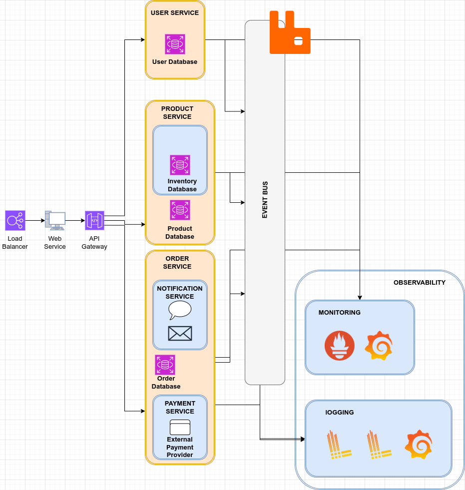

# Simple Design System
The purpose of this task is to make a design system of an ecommerce focusing on observability.

**Logging Tools**
- Promtail: To scrap the logs from the file
- Loki: To store and query logs
- Grafana: To visualize the data

**Monitoring Tools**
- Prometheus: To collect the data
- Grafana: To visualize the data

Here I add RabbitMQ as message broker to handle communication between Services.